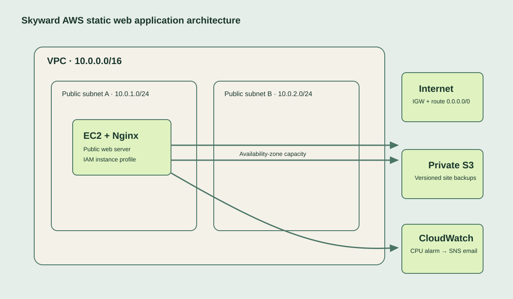

# Skyward — AWS Static Web Hosting Capstone

This repository contains the static site, infrastructure as code, and deployment notes for **Capstone Project 1**. The implementation provisions a secure public EC2 web server in a custom VPC, stores versioned site backups in a private S3 bucket, and sends CloudWatch CPU alarm notifications through SNS.

## Architecture



| Component | Design |
| --- | --- |
| Network | `10.0.0.0/16` VPC with public `10.0.1.0/24` and `10.0.2.0/24` subnets in two availability zones |
| Access | Internet gateway and a public route table; SSH is limited to `allowed_ssh_cidr` |
| Compute | Amazon Linux 2023 EC2 instance running Nginx in the first public subnet |
| Storage | Private, versioned S3 bucket; the EC2 instance role can list and read only this bucket |
| Operations | CloudWatch CPU alarm (>70% for two 5-minute periods) publishes to an SNS email topic |

## Deploy the infrastructure

### Prerequisites

- AWS CLI authenticated to the target account and region
- Terraform 1.6 or newer
- An existing EC2 key pair (only needed if SSH access is desired)

```bash
cd infra
cp terraform.tfvars.example terraform.tfvars
# Edit terraform.tfvars: set your SSH CIDR, key pair name, notification email, and bucket name.
terraform init
terraform plan
terraform apply
```

Confirm the SNS subscription using the email sent by AWS. Then open the `web_url` Terraform output in a browser. The deployment uses an Amazon Linux 2023 AMI from the public SSM parameter, installs Nginx, and serves this repository's site through EC2 user data.

> **Cost and cleanup:** EC2, public IPv4 addressing, and CloudWatch/SNS usage can incur charges. When finished, run `terraform destroy` from `infra/`.

## Publish the demo on GitHub Pages

The static site is also configured to deploy through GitHub Pages. After this branch is merged:

1. In the GitHub repository, open **Settings → Pages** and set **Source** to **GitHub Actions**.
2. Merge or push the workflow and site files to the repository's `main` branch.
3. Open **Actions → Deploy static site to GitHub Pages** to follow the deployment; its environment URL is the published site URL.

The workflow publishes only `site/`, so Terraform configuration, deployment templates, and documentation are not exposed by the GitHub Pages site. You can also run the workflow manually with **Run workflow**. 【.github/workflows/deploy-pages.yml】

## Update the website

After editing `site/`, publish the assets to the private backup bucket:

```bash
./scripts/sync-to-s3.sh YOUR_UNIQUE_BUCKET_NAME
```

To update the live EC2 site, copy `site/` to `/usr/share/nginx/html` using an approved deployment path (for example, SSH or AWS Systems Manager) and reload Nginx:

```bash
sudo rsync -a --delete site/ /usr/share/nginx/html/
sudo systemctl reload nginx
```

## Verification checklist

1. Visit the EC2 public URL and confirm the Skyward landing page loads.
2. In S3, verify **Versioning** is enabled and public access is blocked.
3. In IAM, verify the EC2 instance profile only has S3 read permissions for this bucket plus CloudWatch agent permissions.
4. In CloudWatch, inspect the `skyward-ec2-high-cpu` alarm and its SNS alarm action.
5. In SNS, confirm the email subscription status is **Confirmed**.

## Repository layout

- `infra/` — Terraform configuration for AWS infrastructure.
- `site/` — Static HTML, CSS, and JavaScript served by Nginx.
- `scripts/` — Local helper for versioned S3 backup uploads.
- `docs/` — Architecture diagram and submission guidance.
